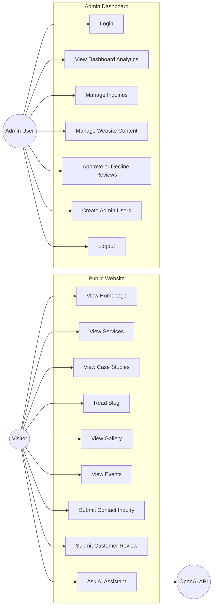
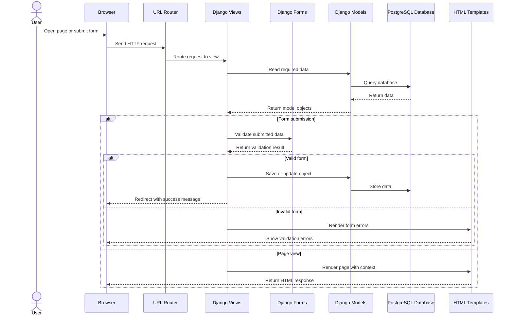
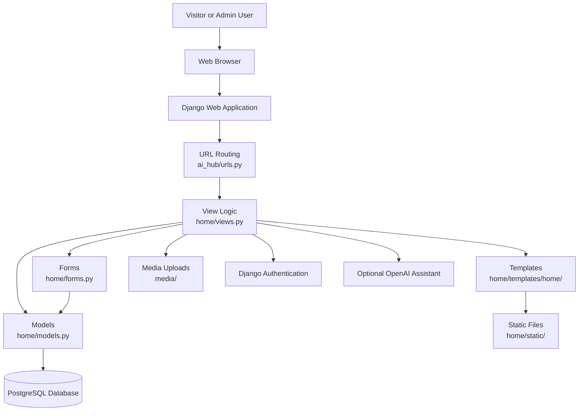
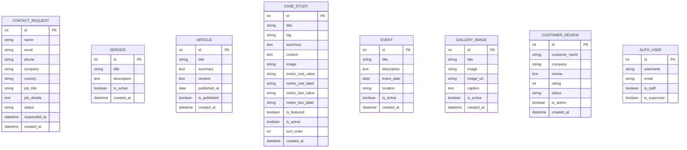

# AI Solution

AI Solution is a Django-based business website and admin dashboard for an AI services company. It includes public pages for services, case studies, reviews, blogs, events, gallery images, contact inquiries, and an optional AI assistant powered by the OpenAI API.

This README is written for beginners who receive this project as a `.zip` file and want to run it on their own computer.

## Project Information

| Item | Details |
| --- | --- |
| Project name | AI Solution |
| Project type | Django web application |
| Current project version | 1.0.0 |
| Main framework | Django 5.2.1 |
| Programming language | Python |
| Tested Python version | Python 3.13.1 |
| Database used in settings | PostgreSQL |
| Optional AI feature | OpenAI assistant |
| Frontend | Django templates, HTML, CSS |
| Static files location | `home/static/` |
| Media upload location | `media/` |

## Project Workflow Diagram

```mermaid
graph TD
    A[AI Solution System Project] --> B[1. Planning]
    A --> C[2. Design]
    A --> D[3. Frontend Development]
    A --> E[4. Backend Development]
    A --> F[5. Database Integration]
    A --> G[6. Testing]
    A --> H[7. Deployment]
    A --> I[8. Documentation]

    B --> B1[Requirements Gathering]
    B --> B2[Project Scope]
    B --> B3[Feature List]

    C --> C1[UI Wireframes]
    C --> C2[System Architecture]
    C --> C3[Database Design]

    D --> D1[Homepage]
    D --> D2[Services Page]
    D --> D3[Case Studies Page]
    D --> D4[Blog Page]
    D --> D5[Gallery Page]
    D --> D6[Events Page]
    D --> D7[Reviews Page]
    D --> D8[Contact Form]
    D --> D9[AI Assistant Page]

    E --> E1[Django Models]
    E --> E2[Views and URLs]
    E --> E3[Forms]
    E --> E4[Custom Admin Dashboard]
    E --> E5[Authentication]
    E --> E6[Content CRUD]
    E --> E7[Inquiry Management]

    F --> F1[PostgreSQL Setup]
    F --> F2[Migrations]
    F --> F3[Data Storage]
    F --> F4[Media Uploads]

    G --> G1[Page Testing]
    G --> G2[Form Testing]
    G --> G3[Admin Testing]
    G --> G4[Cross-browser Testing]
    G --> G5[Bug Fixing]

    H --> H1[Environment Configuration]
    H --> H2[Static Files Setup]
    H --> H3[Media Files Setup]
    H --> H4[Production Checklist]
    H --> H5[Live URL]

    I --> I1[README Documentation]
    I --> I2[Setup Instructions]
    I --> I3[User Guide]
    I --> I4[Technical Notes]
```



## Work Breakdown Structure

```mermaid
graph TD
    A["AI Solution System Project"]

    A --> B["Planning"]
    B --> B1["Requirements Gathering"]
    B --> B2["Project Scope"]
    B --> B3["Feature List"]

    A --> C["Design"]
    C --> C1["UI Wireframes"]
    C --> C2["System Architecture"]
    C --> C3["Database Design"]

    A --> D["Frontend Development"]
    D --> D1["Homepage"]
    D --> D2["Services Page"]
    D --> D3["Case Studies Page"]
    D --> D4["Blog Page"]
    D --> D5["Gallery Page"]
    D --> D6["Events Page"]
    D --> D7["Reviews Page"]
    D --> D8["Contact Page"]
    D --> D9["AI Assistant Page"]

    A --> E["Backend Development"]
    E --> E1["Django Models"]
    E --> E2["Views and URLs"]
    E --> E3["Forms"]
    E --> E4["Authentication"]
    E --> E5["Custom Admin Dashboard"]
    E --> E6["Content CRUD"]
    E --> E7["Inquiry Management"]

    A --> F["Database Integration"]
    F --> F1["PostgreSQL Setup"]
    F --> F2["Migrations"]
    F --> F3["Data Storage"]
    F --> F4["Media Uploads"]

    A --> G["Testing"]
    G --> G1["Page Testing"]
    G --> G2["Form Testing"]
    G --> G3["Admin Testing"]
    G --> G4["Cross-browser Testing"]
    G --> G5["Bug Fixing"]

    A --> H["Deployment"]
    H --> H1["Environment Configuration"]
    H --> H2["Static Files Setup"]
    H --> H3["Media Files Setup"]
    H --> H4["Production Checklist"]
    H --> H5["Live URL"]

    A --> I["Documentation"]
    I --> I1["README Documentation"]
    I --> I2["Setup Instructions"]
    I --> I3["User Guide"]
    I --> I4["Technical Notes"]
```



| WBS Code | Work Package | Description |
| --- | --- | --- |
| 1.0 | AI Solution System Project | Complete Django-based AI services website and admin dashboard. |
| 1.1 | Planning | Define the project requirements, scope, and required features. |
| 1.1.1 | Requirements Gathering | Identify website pages, admin features, database needs, and AI assistant requirements. |
| 1.1.2 | Project Scope | Confirm the public website, admin dashboard, content management, and deployment scope. |
| 1.1.3 | Feature List | Prepare the list of pages, forms, dashboards, and management features. |
| 1.2 | Design | Prepare the structure and design plan for the system. |
| 1.2.1 | UI Wireframes | Plan layouts for public pages and admin dashboard screens. |
| 1.2.2 | System Architecture | Define the Django project structure, app structure, URLs, templates, and static files. |
| 1.2.3 | Database Design | Design models for services, articles, case studies, events, gallery images, reviews, and inquiries. |
| 1.3 | Frontend Development | Build the public user-facing website pages. |
| 1.3.1 | Homepage | Develop the main landing page for AI Solution. |
| 1.3.2 | Services Page | Display AI services offered by the company. |
| 1.3.3 | Case Studies Page | Display completed projects and case study details. |
| 1.3.4 | Blog Page | Display articles and blog content. |
| 1.3.5 | Gallery Page | Display uploaded gallery images. |
| 1.3.6 | Events Page | Display upcoming and past events. |
| 1.3.7 | Reviews Page | Display approved customer reviews and review submission form. |
| 1.3.8 | Contact Page | Create a contact form for user inquiries. |
| 1.3.9 | AI Assistant Page | Provide an optional AI assistant interface. |
| 1.4 | Backend Development | Build Django logic for public pages, admin features, and data handling. |
| 1.4.1 | Django Models | Create database models for all website content and inquiries. |
| 1.4.2 | Views and URLs | Create page views and URL routes. |
| 1.4.3 | Forms | Build contact, review, and content management forms. |
| 1.4.4 | Authentication | Implement admin login and access control. |
| 1.4.5 | Custom Admin Dashboard | Build dashboard pages for analytics and management. |
| 1.4.6 | Content CRUD | Add create, read, update, and delete features for website content. |
| 1.4.7 | Inquiry Management | Allow admins to view, search, respond to, and delete inquiries. |
| 1.5 | Database Integration | Connect the application with PostgreSQL and handle stored data. |
| 1.5.1 | PostgreSQL Setup | Configure PostgreSQL database connection. |
| 1.5.2 | Migrations | Create and apply Django migrations. |
| 1.5.3 | Data Storage | Store website content, reviews, events, and contact inquiries. |
| 1.5.4 | Media Uploads | Store uploaded images inside the media folder. |
| 1.6 | Testing | Verify that the website and admin dashboard work correctly. |
| 1.6.1 | Page Testing | Check all public pages load correctly. |
| 1.6.2 | Form Testing | Test contact form, review form, and admin forms. |
| 1.6.3 | Admin Testing | Test login, dashboard, content management, and inquiry management. |
| 1.6.4 | Cross-browser Testing | Check the website in major browsers. |
| 1.6.5 | Bug Fixing | Fix issues found during testing. |
| 1.7 | Deployment | Prepare the project for live hosting. |
| 1.7.1 | Environment Configuration | Configure environment variables and production settings. |
| 1.7.2 | Static Files Setup | Prepare CSS and static files for hosting. |
| 1.7.3 | Media Files Setup | Configure uploaded media files for hosting. |
| 1.7.4 | Production Checklist | Confirm security, database, and deployment requirements. |
| 1.7.5 | Live URL | Deploy and verify the live website URL. |
| 1.8 | Documentation | Prepare project documentation for setup, use, and maintenance. |
| 1.8.1 | README Documentation | Write project overview and setup information. |
| 1.8.2 | Setup Instructions | Explain installation, database setup, migrations, and server start commands. |
| 1.8.3 | User Guide | Explain website usage and admin dashboard usage. |
| 1.8.4 | Technical Notes | Document project files, security notes, and deployment checklist. |

## UML Diagrams

### Use Case Diagram



### Class Diagram

```mermaid
classDiagram
    class ContactRequest {
        +String name
        +String email
        +String phone
        +String company
        +String country
        +String job_title
        +Text job_details
        +String status
        +DateTime responded_at
        +DateTime created_at
        +__str__()
    }

    class Service {
        +String title
        +Text description
        +Boolean is_active
        +DateTime created_at
        +__str__()
    }

    class Article {
        +String title
        +Text summary
        +Text content
        +Date published_at
        +Boolean is_published
        +DateTime created_at
        +__str__()
    }

    class CaseStudy {
        +String title
        +String tag
        +Text summary
        +Text content
        +Image image
        +String metric_one_value
        +String metric_one_label
        +String metric_two_value
        +String metric_two_label
        +Boolean is_featured
        +Boolean is_active
        +Integer sort_order
        +DateTime created_at
        +__str__()
    }

    class Event {
        +String title
        +Text description
        +Date event_date
        +String location
        +Boolean is_active
        +DateTime created_at
        +is_upcoming()
        +event_status_label()
        +event_status_class()
        +__str__()
    }

    class GalleryImage {
        +String title
        +Image image
        +URL image_url
        +Text caption
        +Boolean is_active
        +DateTime created_at
        +__str__()
    }

    class CustomerReview {
        +String customer_name
        +String company
        +Text review
        +Integer rating
        +String status
        +Boolean is_active
        +DateTime created_at
        +__str__()
    }

    class ContactRequestForm
    class ServiceForm
    class ArticleForm
    class PublicArticleForm
    class CaseStudyForm
    class EventForm
    class GalleryImageForm
    class CustomerReviewForm
    class PublicCustomerReviewForm
    class AdminUserCreationForm

    ContactRequestForm ..> ContactRequest
    ServiceForm ..> Service
    ArticleForm ..> Article
    PublicArticleForm ..> Article
    CaseStudyForm ..> CaseStudy
    EventForm ..> Event
    GalleryImageForm ..> GalleryImage
    CustomerReviewForm ..> CustomerReview
    PublicCustomerReviewForm ..> CustomerReview
```



### Sequence Diagram



### Architecture Diagram



### Database Design



## System Requirements

### Minimum Requirements

| Requirement | Minimum |
| --- | --- |
| Operating system | Windows 10, Windows 11, macOS, or Linux |
| RAM | 4 GB |
| Storage | 1 GB free space |
| Python | Python 3.11 or newer |
| Database | PostgreSQL 14 or newer |
| Browser | Chrome, Edge, Firefox, or Safari |
| Internet | Required only for installing packages and using the OpenAI assistant |

### Recommended Requirements

| Requirement | Recommended |
| --- | --- |
| Operating system | Windows 11 |
| RAM | 8 GB or more |
| Storage | 2 GB free space |
| Python | Python 3.13.1 |
| Database | PostgreSQL 16 or newer |
| Browser | Latest Chrome or Edge |

## Main Features

- Public home page for AI Solution.
- Services page with active services.
- Case studies page with image upload support.
- Customer review page and public review submission form.
- Blog/articles page.
- Events page with upcoming and past event status.
- Gallery page with uploaded images.
- Contact form with name, email, phone, company, country, job title, and job details.
- Secure custom admin dashboard.
- Admin inquiry management: view, search, mark responded, and delete.
- Admin content management for services, articles, case studies, events, gallery images, and reviews.
- Admin analytics dashboard.
- Admin user creation page.
- Optional AI assistant using OpenAI API.
- Admin inactivity timeout after 2 minutes.

## Project Folder Structure

```text
ai_hub/
├── ai_hub/                  # Main Django project settings and URLs
│   ├── settings.py
│   ├── urls.py
│   ├── asgi.py
│   └── wsgi.py
├── home/                    # Main website application
│   ├── migrations/
│   ├── static/home/css/
│   ├── templates/home/
│   ├── admin.py
│   ├── apps.py
│   ├── forms.py
│   ├── middleware.py
│   ├── models.py
│   └── views.py
├── media/                   # Uploaded images and media files
├── .env.example             # Example environment variables
├── db.sqlite3               # Existing SQLite file, not used by current settings
├── manage.py                # Django command file
├── requirements.txt         # Python packages
└── README.md
```

## Software You Need to Install

Before running the project, install these tools:

1. Python
   - Download from: https://www.python.org/downloads/
   - During installation on Windows, tick **Add Python to PATH**.

2. PostgreSQL
   - Download from: https://www.postgresql.org/download/
   - Remember the password you set for the `postgres` user.

3. Code editor
   - Recommended: Visual Studio Code.

4. Web browser
   - Recommended: Chrome or Microsoft Edge.

## How to Run the Project from a Zip File

### Step 1: Extract the Zip File

Right-click the zip file and extract it to a simple location, for example:

```text
D:\AI_Solutions\ai_hub
```

Avoid paths with special characters because they can sometimes create beginner setup issues.

### Step 2: Open the Project Folder

Open PowerShell or the VS Code terminal inside the project folder.

Example:

```powershell
cd D:\AI_Solutions\ai_hub
```

You should see `manage.py` in this folder.

### Step 3: Create a Virtual Environment

A virtual environment keeps this project's packages separate from other Python projects.

```powershell
python -m venv venv
```

Activate it:

```powershell
venv\Scripts\activate
```

After activation, your terminal usually shows `(venv)` at the beginning of the line.

For macOS or Linux:

```bash
python3 -m venv venv
source venv/bin/activate
```

### Step 4: Install Required Packages

```powershell
pip install -r requirements.txt
```

Installed main packages include:

```text
Django==5.2.1
openai>=1.99.0
Pillow>=10.0.0
psycopg2-binary==2.9.12
python-dotenv>=1.0.1
```

### Step 5: Create the Environment File

Copy `.env.example` and rename the copy to `.env`.

Windows PowerShell:

```powershell
Copy-Item .env.example .env
```

Then open `.env` and update it if needed.

Basic `.env` example:

```env
OPENAI_API_KEY=your-openai-api-key
OPENAI_MODEL=gpt-4.1-mini
OPENAI_TIMEOUT=20
OPENAI_MAX_OUTPUT_TOKENS=220
ASSISTANT_CONTEXT_CACHE_SECONDS=300
```

The OpenAI key is optional. The website can still run without it, but the AI assistant will show an unavailable message for questions that are not answered by the built-in FAQ.

### Step 6: Create the PostgreSQL Database

The current project settings use PostgreSQL.

Default database values in `ai_hub/settings.py` are:

```text
Database name: ai_hub
Database user: your_user
Database password: your_password
Database host: localhost
Database port: 5432
```

Create a PostgreSQL database named:

```text
ai_hub
```

You can create it using pgAdmin or using the terminal.

Using PostgreSQL terminal:

```sql
CREATE DATABASE ai_hub;
```

If your PostgreSQL username, password, host, or port is different, add these values to your `.env` file:

```env
POSTGRES_DB=ai_hub
POSTGRES_USER=postgres
POSTGRES_PASSWORD=your-postgres-password
POSTGRES_HOST=localhost
POSTGRES_PORT=5432
```

Important: Set the  PostgreSQL passwor `POSTGRES_PASSWORD` in `.env`.

### Step 7: Run Database Migrations

Migrations create the required database tables.

```powershell
python manage.py migrate
```

### Step 8: Create an Admin User

Create your first admin account:

```powershell
python manage.py createsuperuser
```

Enter a username, email, and password when asked.

This account is used to log in to the custom admin dashboard.

### Step 9: Start the Development Server

```powershell
python manage.py runserver
```

If everything is working, the terminal will show a local URL like:

```text
http://127.0.0.1:8000/
```

Open that URL in your browser.

## Important Website URLs

| Page | URL |
| --- | --- |
| Home | `http://127.0.0.1:8000/` |
| Services | `http://127.0.0.1:8000/services/` |
| Case Studies | `http://127.0.0.1:8000/case-studies/` |
| Reviews | `http://127.0.0.1:8000/reviews/` |
| Submit Review | `http://127.0.0.1:8000/reviews/submit/` |
| Blog | `http://127.0.0.1:8000/blog/` |
| Gallery | `http://127.0.0.1:8000/gallery/` |
| Events | `http://127.0.0.1:8000/events/` |
| AI Assistant | `http://127.0.0.1:8000/assistant/` |
| Contact | `http://127.0.0.1:8000/contact/` |
| Admin Login | `http://127.0.0.1:8000/admin-panel/login/` |
| Admin Dashboard | `http://127.0.0.1:8000/admin-panel/` |
| Admin Analytics | `http://127.0.0.1:8000/admin-panel/analytics/` |
| Manage Inquiries | `http://127.0.0.1:8000/admin-panel/inquiries/` |
| Manage Content | `http://127.0.0.1:8000/admin-panel/content/` |
| Manage Admin Users | `http://127.0.0.1:8000/admin-panel/users/` |

## How to Use the Admin Dashboard

1. Go to:

```text
http://127.0.0.1:8000/admin-panel/login/
```

2. Log in using the superuser account you created.

3. From the dashboard, you can:
   - View total inquiries.
   - View new and responded inquiries.
   - See recent inquiries.
   - Manage services.
   - Manage articles/blogs.
   - Manage case studies.
   - Manage events.
   - Manage gallery images.
   - Approve or decline customer reviews.
   - Create admin users.

Admin users must have `is_staff=True`.

## Managing Website Content

Use the admin content panel:

```text
http://127.0.0.1:8000/admin-panel/content/
```

Available content sections:

- Services
- Articles
- Case Studies
- Events
- Gallery Images
- Customer Reviews

For image uploads, make sure the `media/` folder exists. Uploaded files are stored inside this folder.

## Contact Form Fields

The contact form collects:

- Name
- Email
- Phone
- Company name
- Country
- Job title
- Job details

Submitted contact requests appear in:

```text
http://127.0.0.1:8000/admin-panel/inquiries/
```

Admins can search inquiries, filter by status, mark an inquiry as responded, or delete it.

## Customer Review Flow

1. A visitor submits a review from:

```text
http://127.0.0.1:8000/reviews/submit/
```

2. The review is saved as pending and inactive.

3. Admin approves or declines the review.

4. Approved reviews become visible on the public reviews page.

## AI Assistant Setup

The AI assistant has two answer methods:

1. Built-in FAQ answers for common questions.
2. OpenAI API answers for other questions.

To enable OpenAI answers, add a valid key in `.env`:

```env
OPENAI_API_KEY=your-real-openai-api-key
```

Optional settings:

```env
OPENAI_MODEL=gpt-4.1-mini
OPENAI_TIMEOUT=20
OPENAI_MAX_OUTPUT_TOKENS=220
ASSISTANT_CONTEXT_CACHE_SECONDS=300
```

If no OpenAI key is provided, the project still runs normally, but the assistant may return:

```text
AI assistant is temporarily unavailable.
```

## Common Commands

Activate virtual environment:

```powershell
venv\Scripts\activate
```

Install packages:

```powershell
pip install -r requirements.txt
```

Run migrations:

```powershell
python manage.py migrate
```

Create admin user:

```powershell
python manage.py createsuperuser
```

Start server:

```powershell
python manage.py runserver
```

Stop server:

```text
Press CTRL + C in the terminal
```

## Troubleshooting

### Problem: `python` is not recognized

Python is not added to PATH.

Fix:

- Reinstall Python.
- Tick **Add Python to PATH** during installation.
- Close and reopen PowerShell.

### Problem: `pip install -r requirements.txt` fails

Try upgrading pip:

```powershell
python -m pip install --upgrade pip
pip install -r requirements.txt
```

### Problem: PostgreSQL connection error

Check these points:

- PostgreSQL is installed.
- PostgreSQL service is running.
- Database `ai_hub` exists.
- Username and password are correct.
- `.env` contains the correct `POSTGRES_PASSWORD`.
- Port is usually `5432`.

### Problem: password authentication failed for user `postgres`

Your PostgreSQL password is different from the default value in the project.

Add this to `.env`:

```env
POSTGRES_PASSWORD=your-postgres-password
```

### Problem: `no database named ai_hub`

Create the database first:

```sql
CREATE DATABASE ai_hub;
```

Then run:

```powershell
python manage.py migrate
```

### Problem: images are not showing

Check that:

- `DEBUG=True` in development.
- Uploaded images exist inside `media/`.
- The page is being opened through `python manage.py runserver`, not directly as an HTML file.

### Problem: cannot log in to admin dashboard

Check that:

- You created a superuser.
- The user has `is_staff=True`.
- You are using the custom login page:

```text
http://127.0.0.1:8000/admin-panel/login/
```

### Problem: admin logs out quickly

This project has an admin inactivity timeout of 2 minutes. If the admin does not interact with the dashboard for 2 minutes, the user is logged out automatically.

## Notes About SQLite

This project folder contains a `db.sqlite3` file, but the current `settings.py` uses PostgreSQL:

```python
'ENGINE': 'django.db.backends.postgresql'
```

For normal setup, use PostgreSQL. Only change to SQLite if you intentionally edit `ai_hub/settings.py`.

## Development Notes

- Main settings file: `ai_hub/settings.py`
- Main URL file: `ai_hub/urls.py`
- Main app: `home`
- Public views and admin dashboard logic: `home/views.py`
- Database models: `home/models.py`
- Forms: `home/forms.py`
- Admin timeout middleware: `home/middleware.py`
- Templates: `home/templates/home/`
- CSS: `home/static/home/css/site.css`

## Security Notes

Before deploying this project online:

- Set `DEBUG=False`.
- Use a strong secret key.
- Add your domain to `ALLOWED_HOSTS`.
- Store real passwords and API keys in environment variables.
- Do not share your `.env` file publicly.
- Use HTTPS on the live server.
- Use a production-ready web server such as Gunicorn or uWSGI behind Nginx or Apache.
- Configure static and media file serving correctly.
- Use a strong PostgreSQL password.

## Deployment Checklist

Before giving the website to real users:

- Confirm all pages open correctly.
- Confirm contact form saves inquiries.
- Confirm admin can log in.
- Confirm admin can manage content.
- Confirm image upload works.
- Confirm review approval works.
- Confirm OpenAI assistant works if enabled.
- Set production environment variables.
- Run migrations on the production database.
- Collect static files if your hosting platform requires it:

```powershell
python manage.py collectstatic
```

## Beginner Setup Summary

For a quick reminder, the full beginner flow is:

```powershell
cd D:\AI_Solutions\ai_hub
python -m venv venv
venv\Scripts\activate
pip install -r requirements.txt
Copy-Item .env.example .env
python manage.py migrate
python manage.py createsuperuser
python manage.py runserver
```

Then open:

```text
http://127.0.0.1:8000/
```

Admin login:

```text
http://127.0.0.1:8000/admin-panel/login/
```

## License

This project is prepared for educational, client demonstration, and business website development purposes. Add your final license here if you plan to publish it publicly on GitHub.
